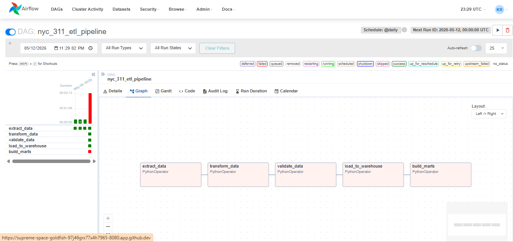
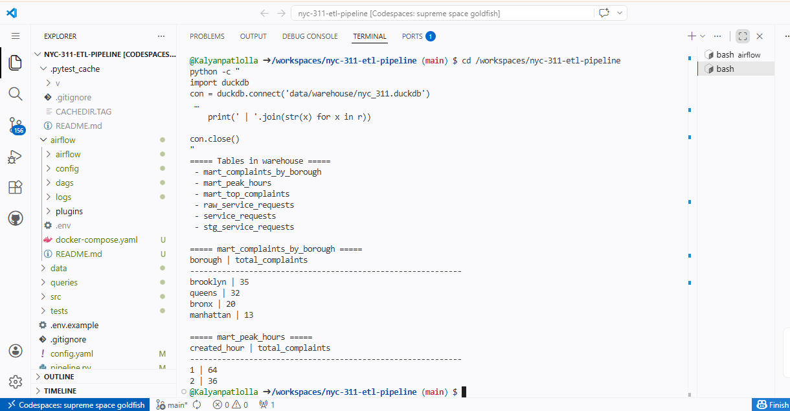
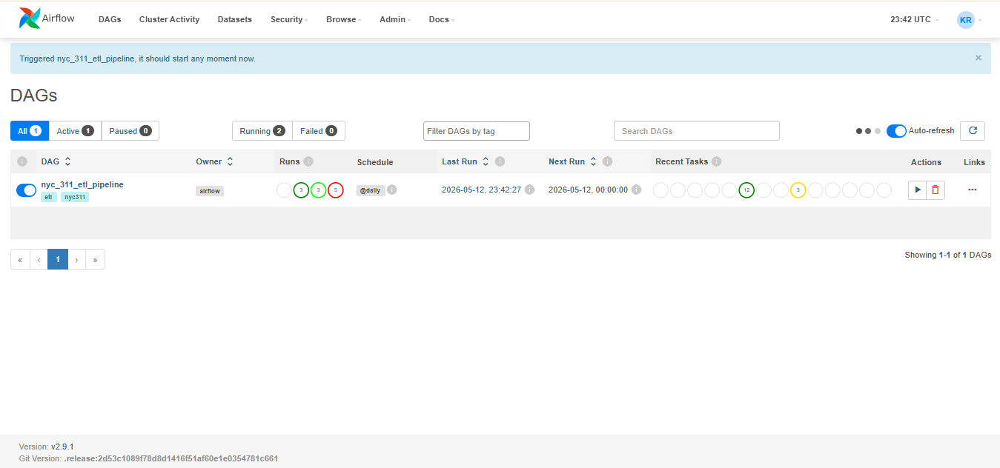
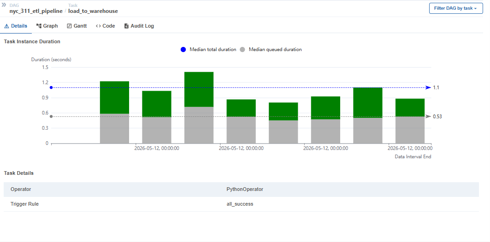
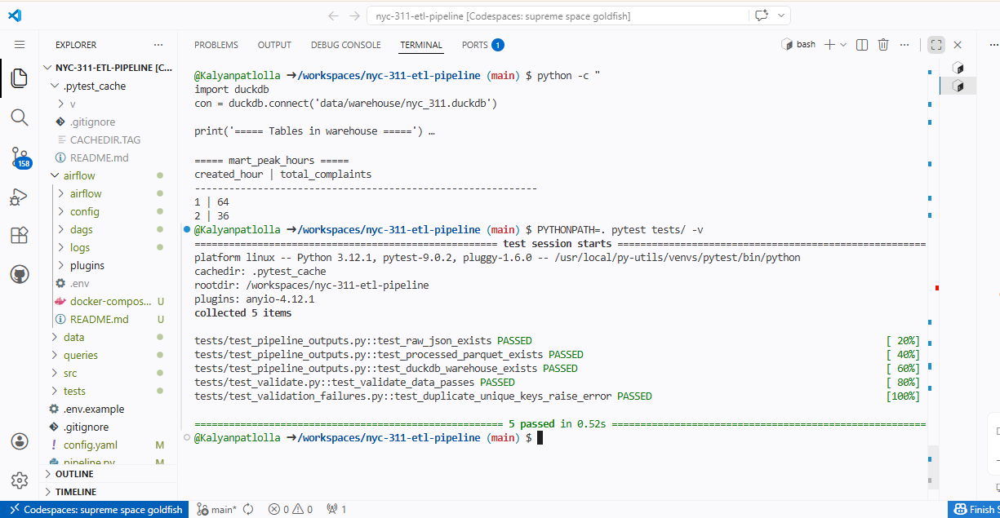
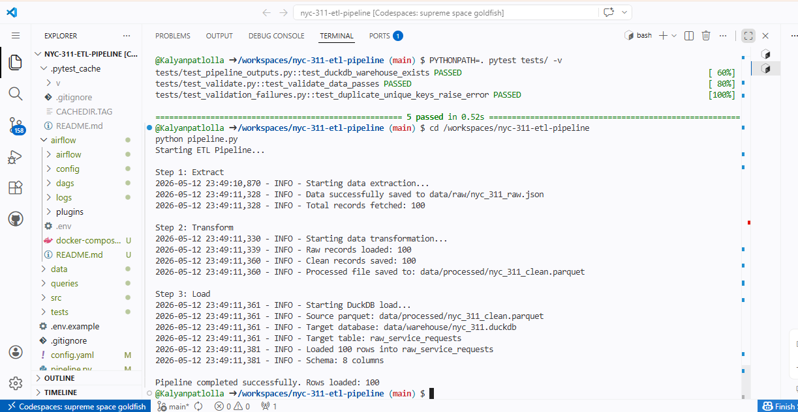

# 🚀 NYC 311 ETL Pipeline

End-to-end data engineering project that extracts NYC 311 service request data from a public REST API, transforms it with Python and Pandas, validates the data, loads it into a local DuckDB warehouse with layered structure (raw → staging → marts), and orchestrates the whole flow with Apache Airflow running in Docker.

> **Note:** This is a hands-on **learning project** built to understand how a real ETL pipeline fits together. The goal is depth of understanding, not enterprise-scale deployment.

---

## 📌 Project Overview

This pipeline demonstrates the core building blocks of a data engineering workflow:

- **Extract** real data from the [NYC Open Data 311 API](https://data.cityofnewyork.us/Social-Services/311-Service-Requests-from-2010-to-Present/erm2-nwe9)
- **Transform** raw JSON into clean, typed Parquet using Pandas
- **Validate** the dataset before letting it touch the warehouse
- **Load** clean data into a local DuckDB warehouse
- **Build marts** — pre-computed analytical tables answering specific questions
- **Orchestrate** all of the above with an Airflow DAG (5 tasks, retries, schedule)

Two ways to run it:
- `python pipeline.py` — quick local run from the command line
- Airflow DAG — orchestrated run with retries, logging, and UI

Both execute identical pipeline logic.

---

## 🏗️ Pipeline Architecture

```
NYC 311 REST API
        ↓
   extract_data       (raw JSON → data/raw/)
        ↓
  transform_data      (pandas cleaning → data/processed/*.parquet)
        ↓
  validate_data       (data quality checks; fails loud if bad)
        ↓
 load_to_warehouse    (parquet → DuckDB raw layer)
        ↓
   build_marts        (staging view + 3 analytical mart tables)
```

### Airflow DAG View



---

## 🗄️ Warehouse Layering

The DuckDB warehouse is organized in 3 layers:

```
raw_service_requests          ← raw load, as-is from Parquet
        ↓
stg_service_requests          ← staging view (typed + cleaned)
        ↓
mart_complaints_by_borough    ← complaints aggregated by borough
mart_peak_hours               ← busiest complaint hours
mart_top_complaints           ← top complaint types ranked
```

Each layer has a clear purpose: **raw** preserves what came in, **staging** standardizes it, **marts** pre-compute analytical answers so queries are fast.

### DuckDB Query Output



---

## ⚙️ Tech Stack

- **Python 3.12**
- **Pandas** — data transformation
- **DuckDB** — local analytical warehouse
- **PyArrow** — Parquet read/write
- **Apache Airflow 2.9** — workflow orchestration
- **Docker / Docker Compose** — runs Airflow in containers
- **Requests** — REST API client
- **PyYAML** — config management
- **Tenacity** — retry logic
- **Pytest** — testing

---

## 📂 Project Structure

```
nyc-311-etl-pipeline/
│
├── src/                       # Pipeline source code
│   ├── extract.py             # NYC 311 API → raw JSON (with retry/fallback)
│   ├── transform.py           # raw JSON → cleaned Parquet (pandas)
│   ├── validate.py            # data quality assertions
│   ├── load.py                # Parquet → DuckDB raw table
│   ├── build_marts.py         # staging view + 3 marts
│   ├── run_sql_file.py        # helper to run SQL files against DuckDB
│   ├── utils.py               # shared logger
│   └── __init__.py
│
├── queries/                   # SQL files run by build_marts
│   ├── create_staging_view.sql
│   ├── create_mart_complaints_by_borough.sql
│   ├── create_mart_peak_hours.sql
│   └── create_mart_top_complaints.sql
│
├── tests/                     # Pytest tests
│   ├── test_pipeline_outputs.py     # checks raw/parquet/duckdb files exist
│   ├── test_validate.py             # validation success path
│   └── test_validation_failures.py  # validation failure path
│
├── airflow/                   # Airflow orchestration setup
│   ├── dags/
│   │   └── nyc_311_pipeline_dag.py   # 5-task DAG
│   ├── docker-compose.yaml
│   └── .env
│
├── examples/                  # Ad-hoc query/inspection scripts
│   ├── query_duckdb.py
│   ├── query_mart.py
│   ├── query_peak_hours.py
│   ├── query_top_complaints.py
│   └── inspect_parquet.py
│
├── docs/
│   └── screenshots/           # README images
│
├── data/                      # Pipeline outputs (git-ignored)
│   ├── raw/                   # raw JSON from API
│   ├── processed/             # cleaned Parquet
│   └── warehouse/             # DuckDB database file
│
├── config.yaml                # API URL, paths, warehouse settings
├── pipeline.py                # End-to-end runner (5 stages)
├── requirements.txt
└── README.md
```

---

## 🔄 Pipeline Stages

### 1. Extract (`src/extract.py`)
- Fetches up to 100 NYC 311 records from the public API
- 3-attempt retry with `time.sleep()` between failures
- Falls back to last good local file if API is unreachable
- Saves to `data/raw/nyc_311_raw.json`

### 2. Transform (`src/transform.py`)
- Reads raw JSON into a pandas DataFrame
- Drops nulls in required columns (`unique_key`, `created_date`, etc.)
- Converts `created_date` to datetime
- Standardizes text fields (`borough` lowercased, `agency` uppercased)
- Adds derived columns: `created_hour`, `created_dayofweek`
- Removes duplicate `unique_key` rows
- Saves clean data as Parquet

### 3. Validate (`src/validate.py`)
Asserts:
- Dataset is not empty
- `unique_key` values are all unique
- All `borough` values are in the expected set (brooklyn, bronx, manhattan, queens, staten island)

Raises `ValueError` if any check fails — pipeline stops before bad data reaches the warehouse.

### 4. Load (`src/load.py`)
- Reads the clean Parquet file
- Creates or replaces `raw_service_requests` table in DuckDB
- Reports row count and schema width

### 5. Build Marts (`src/build_marts.py`)
- Runs 4 SQL files in sequence:
  1. `create_staging_view.sql` — staging view
  2. `create_mart_complaints_by_borough.sql`
  3. `create_mart_peak_hours.sql`
  4. `create_mart_top_complaints.sql`
- All staging/mart layers are rebuilt on every run (idempotent)

---

## ▶️ How to Run

### Prerequisites

- Python 3.10+
- Docker + Docker Compose (only needed for Airflow option)

### Option A: Run the pipeline locally (no Airflow)

```bash
git clone https://github.com/Kalyanpatlolla/nyc-311-etl-pipeline.git
cd nyc-311-etl-pipeline

python -m venv venv
source venv/bin/activate          # macOS/Linux
# venv\Scripts\activate           # Windows

pip install -r requirements.txt
python pipeline.py
```

You should see all 5 stages run in sequence and the warehouse populated.

### Option B: Run via Airflow (Docker)

```bash
cd airflow
docker compose up -d
```

Open [http://localhost:8080](http://localhost:8080) (login: `airflow` / `airflow`), find `nyc_311_etl_pipeline`, toggle it on, and trigger a run.

### Successful Airflow Run



### Sample Task Logs



---

## 🧪 Running the Tests

```bash
PYTHONPATH=. pytest tests/ -v
```

5 tests cover:
- Raw JSON file is created
- Processed parquet file is created
- DuckDB warehouse file is created
- Validation passes on clean data
- Validation raises on bad data

### Pytest Output



---

## 📊 Example Queries (`examples/` folder)

The `examples/` folder has ad-hoc Python scripts demonstrating how to query the warehouse:

```bash
python examples/query_mart.py          # complaints by borough
python examples/query_peak_hours.py    # busiest hours
python examples/query_top_complaints.py # top complaint types
python examples/inspect_parquet.py     # peek at the parquet file
```

### Pipeline Execution Sample



---

## 💡 What I Learned Building This

**Level 1 (Fundamentals):**
- How REST APIs deliver data and how Python consumes them
- The difference between raw JSON and analytical Parquet
- Why ETL is split into stages instead of one script
- What a data warehouse physically is (a queryable file on disk)
- Basic SQL: `WHERE`, `GROUP BY`, `COUNT(DISTINCT)`, `HAVING`, `ORDER BY`

**Level 2 (Production ETL):**
- Why orchestration matters: DAGs vs running scripts manually
- Docker volume mounts: how containers see (or don't see) host files
- The raw → staging → marts pattern and why marts exist
- The difference between cleaning data (fix it) and validating data (refuse to load it)
- Structured logging vs `print()` debugging
- Writing tests for a data pipeline (what's worth testing vs not)

---

## 🚧 What's Deliberately Out of Scope

This project intentionally stays focused on fundamentals and production-style ETL. Not included (yet):

- Spark or distributed processing
- Streaming (Kafka, Kinesis)
- Cloud warehouses (BigQuery, Snowflake, Redshift)
- dbt or other SQL transformation frameworks
- Kubernetes or Terraform
- CI/CD pipelines

These are valuable but belong to a later learning stage. The principle here: understand one warehouse deeply before adding more tools.

---

## 👤 Author

**Venkata Kalyan Reddy Patlolla**
MS in Computer Science — University of Cincinnati
[@Kalyanpatlolla](https://github.com/Kalyanpatlolla)